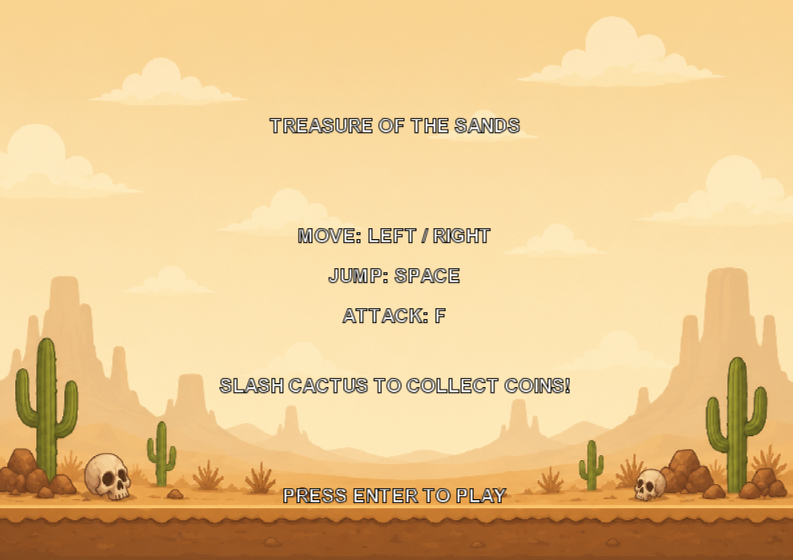
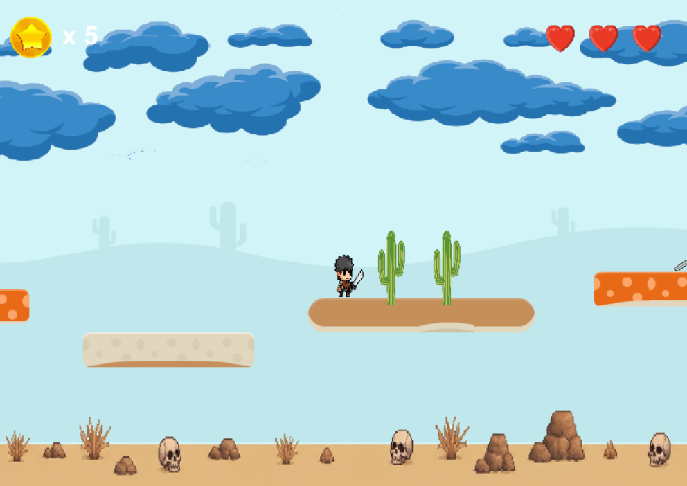
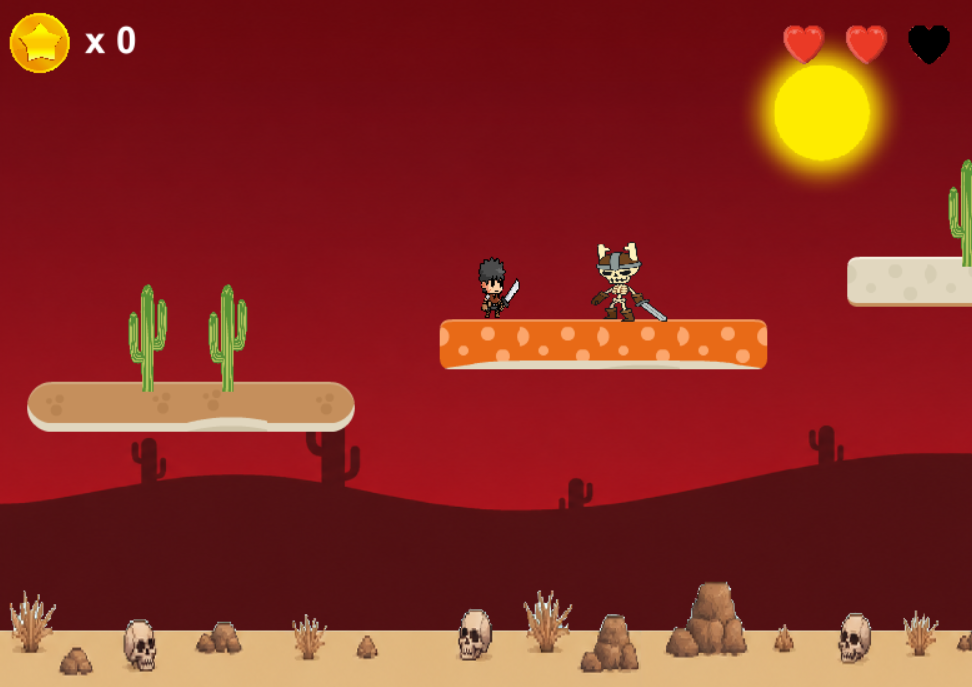

# Treasure of the Sands

Treasure of the Sands is a 2D platform game I developed in Java using Greenfoot.

The player explores the level, avoids obstacles and fights enemies while collecting coins. The goal is to defeat the enemies, collect the required coins and open the treasure chest to progress to the next level.

I created the project to practice Java and object-oriented programming through the development of a playable game.

## Features

- Player movement and jumping
- Attack mechanics
- Character animations
- Enemies and combat
- Coin collection
- Obstacles and platforms
- Treasure chest and level progression
- Sound effects

## Screenshots

### Main Menu

### Level 1

### Level 2

## Built with

- Java
- Greenfoot

## How to run

Download the project and open `project.greenfoot` with Greenfoot. Compile the project and press Run to start the game.

## Author

Konstantinos Vassos
